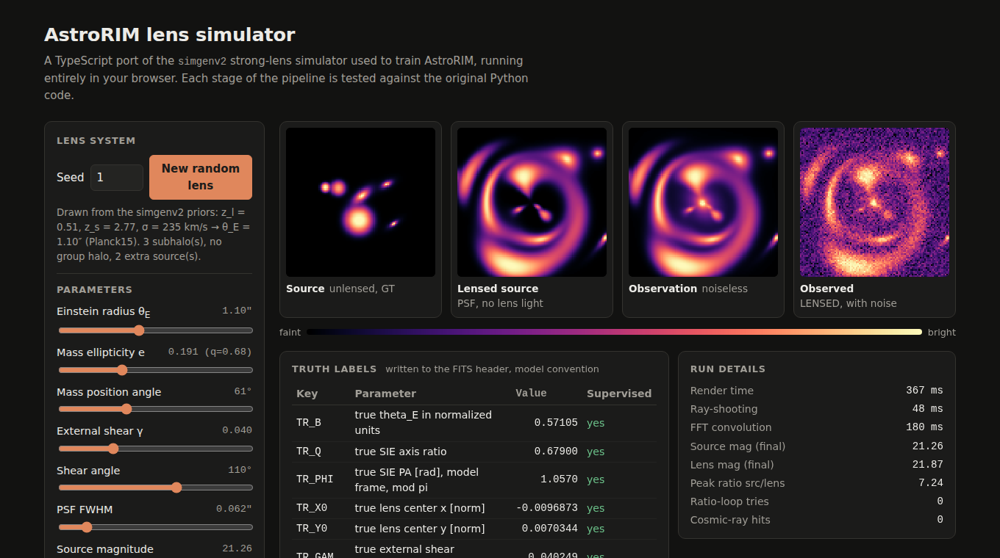

# astrorim-sim-ts

A TypeScript port of `simgenv2`, the strong gravitational lens simulator used to generate training data for
**AstroRIM** (M. Walsh et al., in preparation). It runs in the browser as an interactive demo and in Node as a
FITS generator. Every stage is checked against the original Python code.



**Live demo:** [_Click Me!_](https://mad-at-line.github.io/astrorim-sim-ts/)

## What it does

Given the parameters of a lens system, the simulator produces the same data products as `simgenv2.generate_one`:

| Stage | Physics | Ported from |
| --- | --- | --- |
| Einstein radius | σ → θ<sub>E</sub> for an SIS, Planck15 flat ΛCDM with radiation and a massive neutrino | `sigma_to_thetaE_arcsec`, astropy |
| Mass model | SIE + external shear + optional NFW group halo + SIS subhalos | lenstronomy 1.14 |
| Source | bulge + disk Sérsic, extra sources, star-forming clumps, spiral modulation | `build_sources`, `add_clumps` |
| Lensing | ray-shooting on a 4× super-sampled grid, bilinear interpolation | `LensModel.ray_shooting`, `RegularGridInterpolator` |
| Lens light | elliptical Sérsic aligned with the mass | lenstronomy `SERSIC_ELLIPSE` |
| PSF | elliptical Gaussian/Moffat (the corrected [FIX S1] kernel), FFT convolution | `make_psf_kernel_fixed`, `convolve_fft` |
| Detector | 4×4 binning, sky gradient, PRNU, Poisson + read noise, cosmic rays | `generate_one` |
| Labels | TR_* truth block in the model's parameter convention, TR_MASK, TR_CLEAN | `simgen_truth.py` |
| Output | FITS with Primary + GT + LENSED HDUs and the same header keys | `generate_one` |

## How it is verified

The short version (details and numbers in [VERIFICATION.md](VERIFICATION.md)):

1. **The reference is proven faithful first.** `reference/harness.py` splits `generate_one` into
   *sample parameters → render → add noise*. `reference/check_fidelity.py` shows that, for the same numpy seed,
   the split version reproduces the FITS files written by the unmodified `simgenv2.py` **bit for bit** (40/40 seeds).
2. **Golden files per stage.** `reference/make_golden.py` records numpy's parameter draws and every intermediate
   array for 9 cases chosen to cover each branch (NFW halo, 0–4 subhalos, extra sources, clumps, spirals, clipped and
   unclipped θ<sub>E</sub>, and a forced case that runs the peak-ratio loop). The TS renderer gets the same parameters and
   must match each stage. Worst relative error across all stages: **1.2 × 10⁻⁷** (the float32 rounding floor of the Python
   code). The lens-light and PSF arrays match exactly.
3. **Random stages are checked statistically**, because the TS random generator is not numpy's: distribution moments,
   branch frequencies, and a two-sample KS comparison of 300 TS vs 300 Python simulations (all 12 quantities
   consistent, smallest p = 0.18).
4. **The tests are tested too.** `npm run mutation-check` injects nine typical porting bugs (sign errors, swapped
   axes, an off-by-one convolution, wrong Sérsic/SIE conventions, and so on) and confirms the suite fails. It catches eight.
   The ninth turned out to be an equivalent mutation, meaning it doesn't change the output (explained in VERIFICATION.md).
5. **FITS compatibility.** `reference/check_ts_fits.py` opens TS-generated files with astropy and compares HDUs,
   shapes, dtypes and header keys against a real `simgenv2` file.

## Quick start

```bash
npm ci
npm test               # 200+ tests: golden stages, cosmology, truth labels, RNG, sampling, FITS
npm run dev            # interactive demo at http://localhost:5173
npm run generate -- --n 20 --seed 1 --out sims_ts   # FITS files in the simgenv2 layout
```

Python side (only needed to regenerate the golden files or re-run the fidelity checks):

```bash
python -m venv .venv && . .venv/bin/activate
pip install -r reference/requirements.txt
python reference/check_fidelity.py 40      # harness == simgenv2, bit for bit
python reference/make_golden.py            # rewrites tests/golden/
python reference/check_ts_fits.py sims_ts  # TS FITS files match simgenv2's layout
python reference/compare_distributions.py sims_ts 300
```

## Layout

```
src/            the simulator (no dependencies)
  config.ts       simgenv2 constants (tests/config.test.ts parses simgenv2.py to keep them in sync)
  cosmology.ts    Planck15 distances, sigma -> theta_E
  lens.ts         SIE, SHEAR, NFW, SIS deflections and ray-shooting
  light.ts        elliptical Sersic
  psf.ts, fft.ts  PSF kernel and zero-padded FFT convolution
  params.ts       parameter schema + sampling from the simgenv2 priors
  simulate.ts     render -> noise -> truth, mirroring generate_one
  truth.ts        simgen_truth.py (TR_* labels, mask, clean flag)
  fits.ts         minimal FITS writer; output.ts builds simgenv2-style files
web/            the demo (Vite; simulation runs in a Web Worker)
cli/            Node FITS generator
reference/      the original simgenv2.py + simgen_truth.py (unmodified) and the Python harness
tests/          Vitest suites and tests/golden/ reference data
```

## Design notes

- **Deterministic core, random edges.** `render(params)` has no randomness, which is what makes stage-by-stage
  comparison with Python possible. Sampling and noise take an explicit `Rng`.
- **Float32 casts are mirrored** where `simgenv2` calls `.astype(np.float32)`, so the port agrees to float32 precision
  instead of drifting.
- **One intentional restructuring:** `simgenv2` redoes the interpolation and three FFT convolutions on each try of the
  peak-ratio loop. All of those steps are linear in flux, so the port convolves unit-flux images once and rescales.
  The forced golden case confirms the result is unchanged.
- The simulation runs in a Web Worker so the sliders stay responsive. When the page is opened from `file://`
  (where module workers are blocked) it falls back to the main thread.

## Roadmap

- Resolve the findings in [VERIFICATION.md](VERIFICATION.md#findings-in-simgenv2) (θ<sub>E</sub> pile-up at the clip
  limits, super-grid spacing, GT normalisation in the peak-ratio loop). Fix them in the Python and TypeScript versions together.
- Performance: pack the source and lens convolutions into one complex FFT, move to Float32Array where precision allows.
- Port the other simulator variants (v1, v3–v6) with their own golden files; Airy PSF branch.
- Critical curves and caustics overlay in the demo.

## Credits

Lens and light profiles follow [lenstronomy](https://github.com/lenstronomy/lenstronomy) (Birrer & Amara 2018);
cosmology follows [astropy](https://www.astropy.org/). The simulator design, `simgenv2.py` and `simgen_truth.py`
are part of the AstroRIM project.

This port and its test suite were written with an AI coding assistant (Claude) and checked against the Python
reference as described above.
